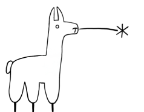
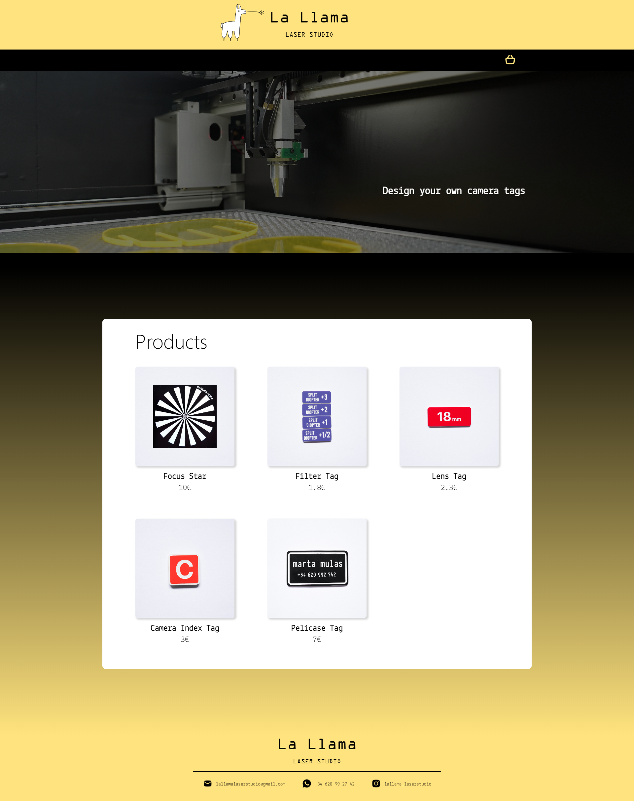
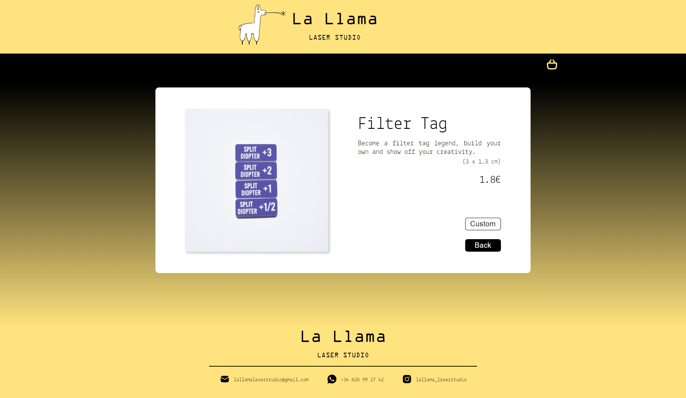
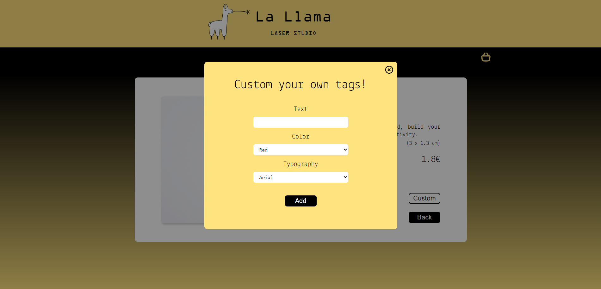
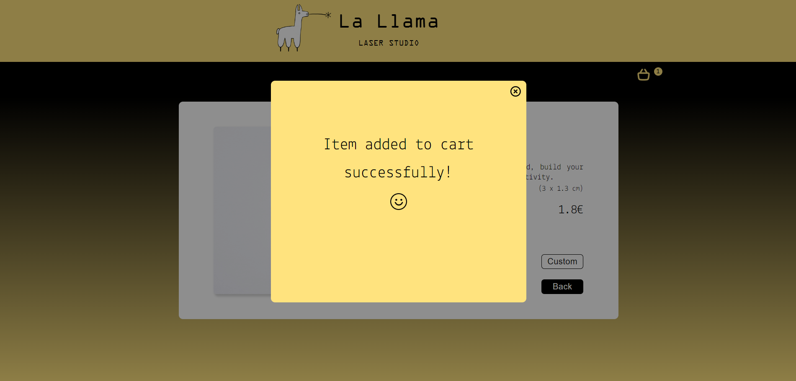
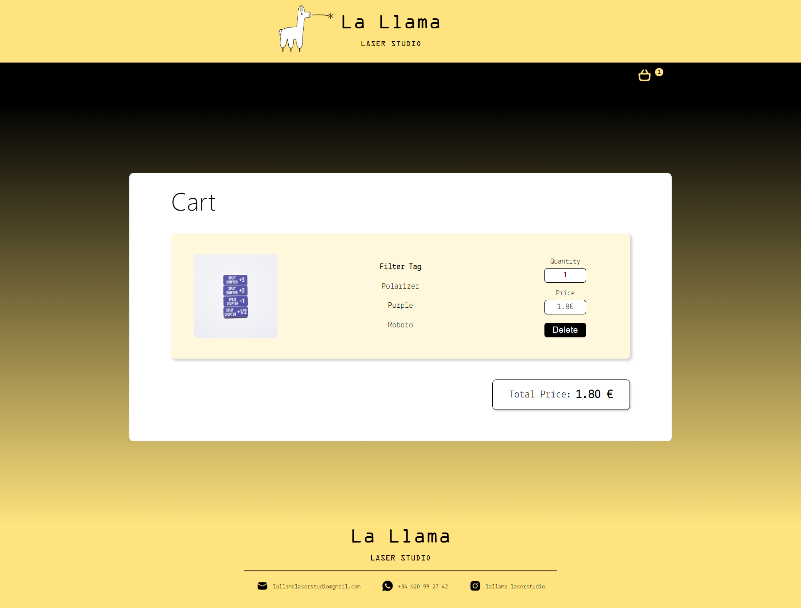

[](https://classroom.github.com/a/xq5TwZF7)

# rc2-template-proyecto-individual-final

# LA LLAMA LASER STUDIO

Crea chivatos de cámara personalizados con tu diseño y recíbelos en casa.



¡Olvídate de los chivatos aburridos! Personaliza tu cámara con nuestra app.

**Diseña chivatos únicos:**

- Elige entre diferentes tipografías y colores.
- Añade el texto que quieras.
- Impresión láser de alta calidad.
- Envío directo a tu casa.

**No solo chivatos:**

- Estrellas de foco para la felicidad de tu foquista.
- Etiquetas personalizadas para maletas Pelicase.

Sé el mejor auxiliar de cámara con todo lo necesario!

Descarga la app y empieza a crear.

## User Journey

[Enlace al Mural](https://app.mural.co/t/lallamalaserstudio5568/m/lallamalaserstudio5568/1710260674048/eb32dc281964ad79c6b8ae3f7c0c13afd030d255?sender=u5254e35ee752a47fd5003532)

## Design

[Diseño en Figma](https://www.figma.com/file/U4inHKj5Ddsl5EHHuv8w3k/La-Llama-Laser-Studio?type=design&node-id=0-1&mode=design&t=VFdynTUq1oA1VBe4-0)

## Technologies


## Installation

### FRONTEND

En la carpeta frontend introduce los siguientes comandos:

```
cd frontend
npm install
npm run dev
```

### BACKEND

Para lanzar el backend necesitamos una base de datos PostgreSQL según
la configuración de `src/main/resources/application.properties`.

```
./mvnw spring:boot run
```

## Architecture

### FRONTED FOLDER STRUCTURE

```
src
├───middleware
│   ├───context
│   └───router
├───presentation
│   ├───assets
│   │   ├───fonts
│   │   └───images
│   ├───components
│   │   ├───Banner
│   │   ├───Cart
│   │   ├───CartBar
│   │   ├───CustomModal
│   │   ├───Footer
│   │   ├───Header
│   │   ├───ModifyModal
│   │   ├───ProductDetail
│   │   ├───ProductList
│   │   └───TotalPrice
│   └───pages
└───services
```

### BACKEND FOLDER STRUCTURE

```
src
├───main
│   ├───java
│   │   └───com
│   │       └───lallamalaserstudio
│   │           └───backend
│   │               ├───controllers
│   │               │   ├───cart
│   │               │   └───tag
│   │               ├───persistence
│   │               │   ├───cart
│   │               │   └───tag
│   │               └───services
│   └───resources
│       ├───static
│       └───templates
└───test
    └───java
        └───com
            └───lallamalaserstudio
                └───backend
```

### BACKEND METHODS

| Method | Path              | Description                               |
| ------ | ----------------- | ----------------------------------------- |
| GET    | /api/products     | Shows all the products                    |
| GET    | /api/products/:id | Shows one product by id                   |
| GET    | /api/cart         | Shows all the products in the cart        |
| POST   | /api/cart         | Adds a product to the cart                |
| DELETE | /api/cart/:id     | Deletes product by id from the cart       |
| PUT    | /api/cart/:id     | Modifies product by id from from the cart |

## Screen shots

**Main page:**



**Detail page:**



**Modal Customize:**



**Modal Customize Confirmation:**



**Cart page:**



## Credits

_Developer:_ [Olaya Sánchez](https://github.com/osaga-fu)
